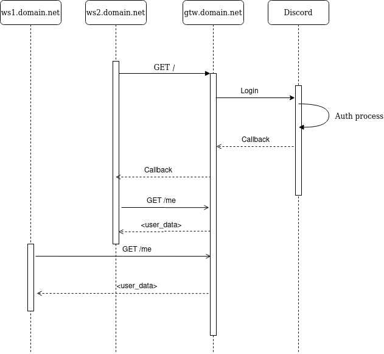

# Discord OAuth Gateway

Share a single discord authentification across a single/multiple domain name using CORS.

## Workflow



### API
+ GET **/** 
    + Request arguments:
        + scope : List of space-separated [Discord scopes](https://discord.com/developers/docs/topics/oauth2)
        + callback : Where to redirect to when auth is complete
+ GET **/me** Retrive user infos. Tries to pull as much infos as scopes allows.
+ GET **/callback** OAuth callback route

## Running it
```sh
# You can also pull the package instead of building it.
docker build -t discord-oauth .
docker run -it \
# Create a discord application to obtain these.
-e OAUTH2_CLIENT_ID=<DISCORD_CLIENT_ID>
-e OAUTH2_CLIENT_SECRET=<DISCORD_CLIENT_SECRET>
# Replace <HOSTED_URL> with the url of this service. (Ex:  gtw.domain.net)  
-e OAUTH2_REDIRECT_URI=<HOSTED_URL>/callback
# Ex : "*" would allow all domains to retrive user infos
-e CORS_DOMAIN_REGEX="<your-domains-regex>"
```